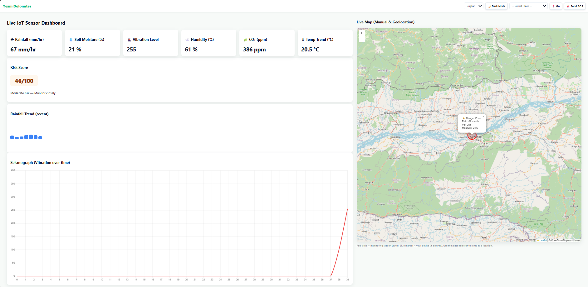
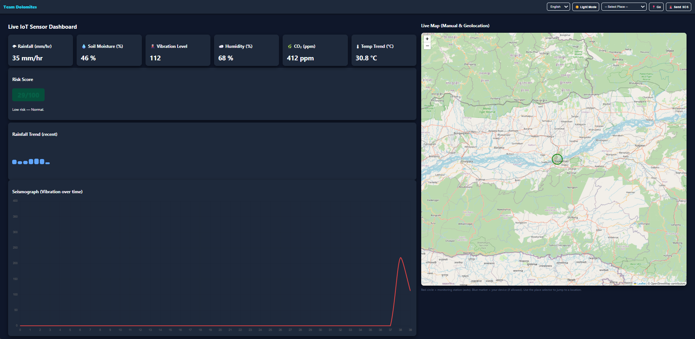

# Team-Dolomites-SIH2025
IoT-based Cloudburst Detection Dashboard - Team Dolomites# 🌦️ IoT-based Cloudburst Detection Dashboard  

## 🧠 Overview
This dashboard demonstrates an IoT-based early warning system for cloudburst-prone regions.  
It displays live data such as rainfall, soil moisture, humidity, vibration levels, CO₂ levels, and temperature trends.  
The system includes a live map view with danger zone indication and a risk score calculator.

## 🧰 Tech Stack
- **Frontend:** HTML, CSS (Grid Layout), JavaScript  
- **Map:** Leaflet.js (OpenStreetMap)  
- **Charts:** Chart.js  
- **Theme:** Manual toggle for Light/Dark mode  
- **Demo:** Currently not connected to IoT; values are simulated for UI demonstration.

## 📊 Dashboard Features
- Real-time visual cards for rainfall, soil moisture, humidity, etc.  
- Interactive live map showing geolocation of danger zones.  
- Seismograph chart showing vibration over time.  
- Responsive full-width layout using pure CSS.  
- White/Dark theme switch manually.  

## 📁 Project Structure
/index.html
/style.css
/script.js
/assets (for icons/images)

## 🚨 Note
This is a **UI demo** of our proposed system for Smart India Hackathon 2025.  
IoT integration (ESP8266 + sensors) 
-MPU6050 (Gyroscope)
-Soil Moisture Sensor
-DHT11 (Temperature & Humidity Sensor)
-Vibration Sensor
-Arduino Board
-ESP8266 Wi-Fi Module
-Breadboard
-Jumper Wires

## 📷 Preview

**🌞 Light Mode**

**🌙 Dark Mode**

